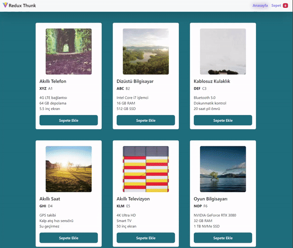

<h1>Redux Thunk E-Ticaret Uygulaması</h1>

Bu proje Redux Thunk kullanılarak geliştirilmiş basit bir e-ticaret uygulamasıdır. Uygulama ürünlerin listelendiği ana sayfa ve kullanıcıların sepetlerini görüntüleyebileceği bir sepet sayfasından oluşmaktadır.

<h2>Proje Amacı</h2>

Redux Thunk'u daha iyi anlamak ve pratik yapmak için geliştirilmiştir. Asenkron veri alışverişi, sepete ürün ekleme, ürün miktarını güncelleme ve sepetten ürün silme gibi temel e-ticaret işlevlerini gerçekleştirebilen bir uygulama sunar.

<h2>Redux Thunk Nedir?</h2>

Redux Thunk, Redux için bir middleware'dir ve asenkron işlemleri yönetmek için kullanılır. Redux Thunk, Redux eylemlerinin içinde asenkron işlemleri gerçekleştirmemizi sağlar.
Redux Thunk'un temel amacı, asenkron veri alışverişini yönetmek için kullanılan eylemleri kolaylaştırmaktır. Örneğin, bir API'den veri almak, bir veritabanına yazmak veya başka bir asenkron görevi gerçekleştirmek için Redux Thunk kullanılabilir.

<h2> Özellikler </h2>

<ul>
<li>Ana sayfada kullanıcılar ürünleri listeleyebilir.</li>
<li>Kullanıcılar, ürün detaylarını görüntüleyebilir ve sepete ekleyebilir.</li>
<li>Kullanıcılar sepetlerini görüntüleyebilir, sepetlerindeki ürün miktarını güncelleyebilir ve sepetten ürün silebilir.</li>
<li>Sepetteki toplam fiyatı gösteren bir özet panel bulunmaktadır.</li>
</ul>

<h2> Proje Yapısı </h2>
<ul>
<li> actions:  Redux eylemlerinin tanımlandığı dosyalar bulunur.</li>
<li> components:  React bileşenlerinin yer aldığı klasördür.</li>
<li> pages:  Ana sayfa ve sepet sayfasının yer aldığı klasördür.</li>
<li> reducers:   Redux reducer'larının bulunduğu dosyaları içerir.</li>
<li> redux:   Redux store ve middleware konfigürasyon dosyalarını içerir.</li>
<li> services:  Veri sağlayıcılarının (API istekleri) tanımlandığı dosyalardır.</li>
</ul>

<h2>Örnek Veri</h2>
Uygulama, başlangıçta bir örnek ürün listesiyle gelmektedir. Bu ürünler, kullanıcının alışveriş deneyimini simüle etmek için kullanılır.

<h2> Kullanılan Teknolojiler </h2>
<ul>
<li> React:  Kullanıcı arayüzü oluşturmak için kullanılan bir JavaScript kütüphanesi.</li>
<li> Redux:  Uygulama durumunun yönetilmesi için kullanılan bir state yönetim kütüphanesi.</li>
<li> Redux Thunk:  Asenkron işlemleri Redux üzerinde yönetmek için kullanılan bir middleware.</li>
<li> React Router:  React uygulamalarında sayfa yönlendirmesi sağlayan bir kütüphane.</li>
<li> Axios:   HTTP istekleri yapmak için kullanılan bir kütüphane.</li>
<li> Bootstrap:  UI bileşenleri oluşturmak için kullanılan bir CSS framework'ü.</li>
</ul>

<h2>Ekran Görüntüsü</h2>

